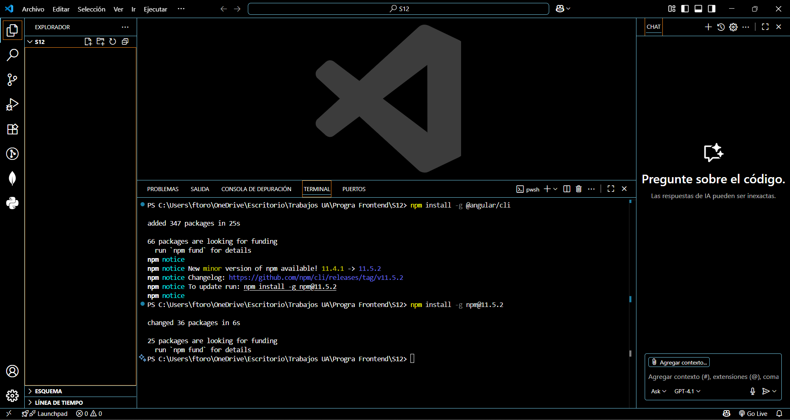
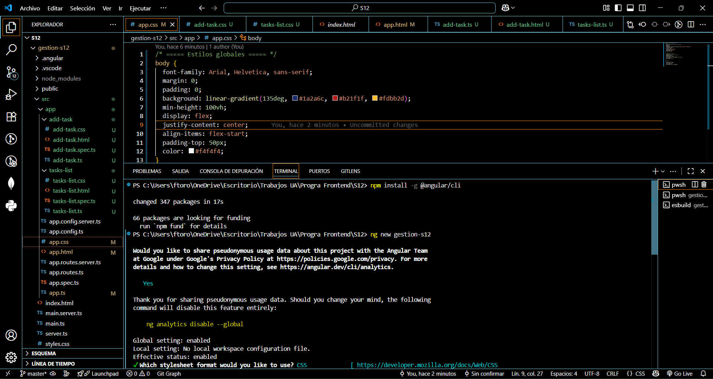
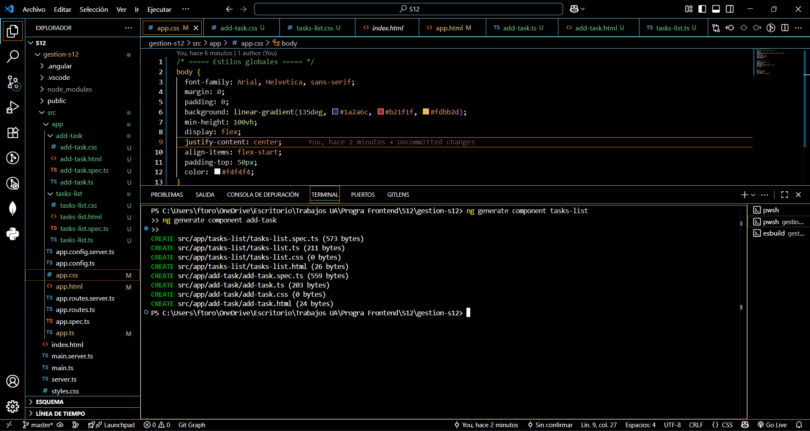
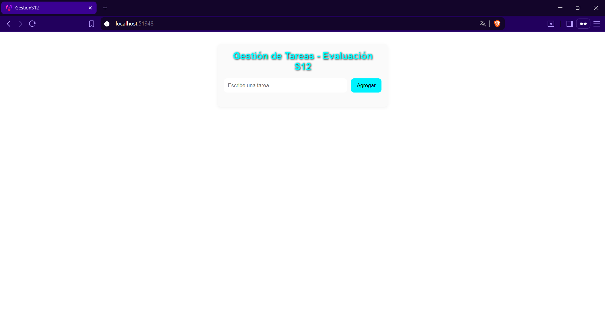
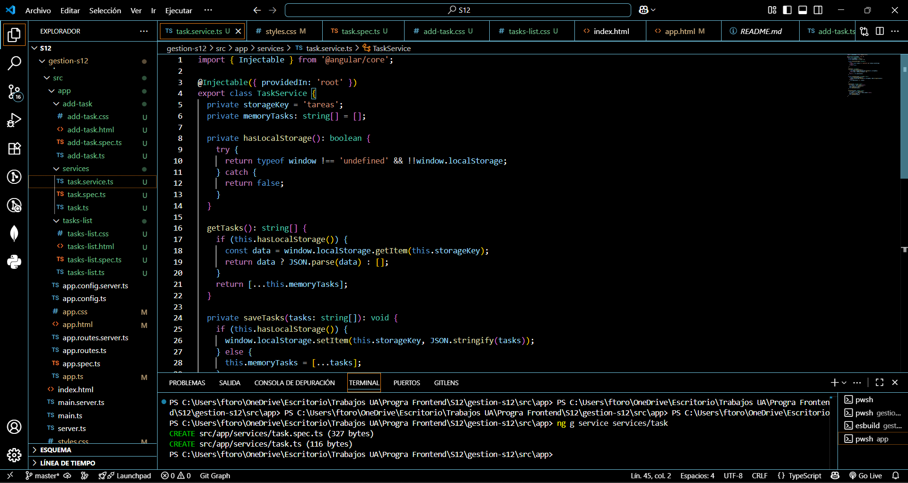
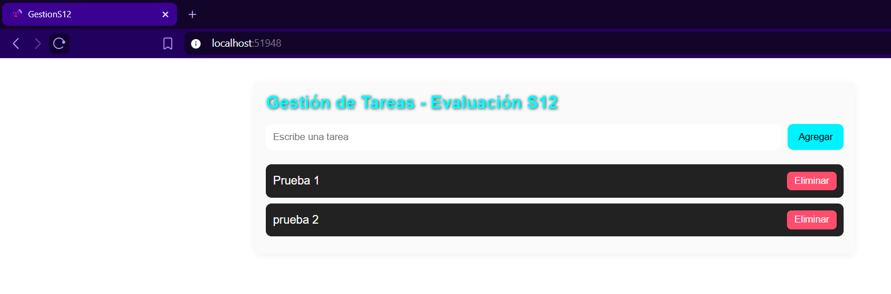
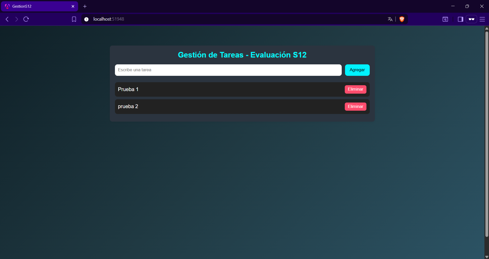
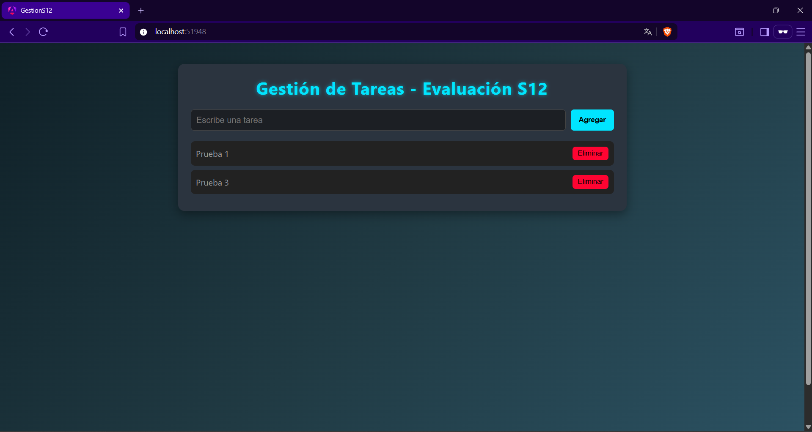

# 📑 Anexo de Evidencias - Evaluación S12

Este documento recopila las capturas de pantalla como respaldo de cada funcionalidad implementada en el proyecto **Gestión de Tareas - S12**.

---

## 1. Instalación de Angular CLI 

---

## 1. Instalación creación del proyecto

---

## 2. Generación de componentes

---

## 3. Ejecución en navegador local

---

## 4. Creación del servicio `task.service.ts`

---

## 5. Persistencia en `localStorage`

---

## 6. Aplicación de estilos CSS personalizados

---

## 7. Página final funcionando

---

## 🎯 Conclusión del anexo
Las evidencias reflejan paso a paso el cumplimiento de la rúbrica, desde la instalación hasta la presentación visual final.  
